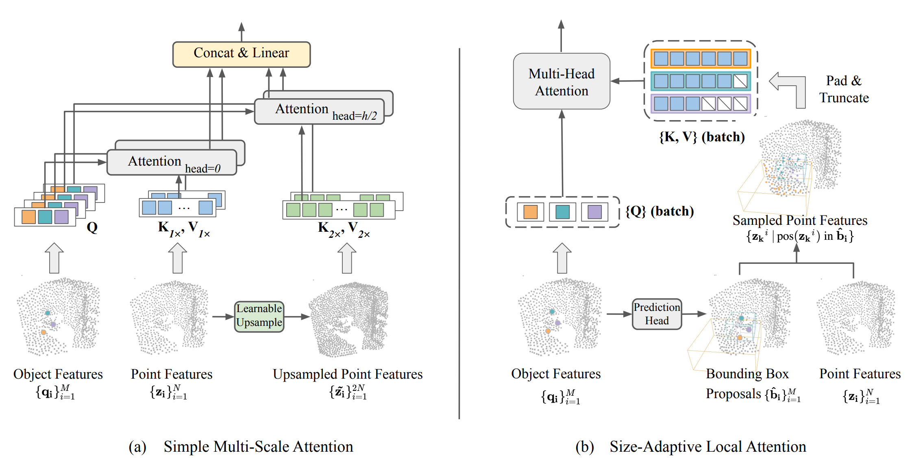

# Hierarchical Point Attention for Indoor 3D Object Detection

This repository provides implementation of [Hierarchical Point Attention for Indoor 3D Object Detection](https://arxiv.org/pdf/2301.02650) (ICRA 2024).    
Authors: Manli Shu, Le Xue, Ning Yu, Roberto Martín-Martín, Caiming Xiong, Tom Goldstein, Juan Carlos Niebles, Ran Xu.

## Overview

<p align="center">
<figure>
  
  <figcaption>An illustration of our hierarchical attention modules.  (a). Simple Multi-Scale Attention (MS-A) learns features at different scales within the multi-head cross-attention module. (b). Size-Adaptive Local Attention (Local-A) extracts localized features for each object candidate by restricting the attention range to be inside its bounding box proposal.</figcaption>
</figure>
</p>


## Environment
This implementation is based on the 4-GPU distributed training setting. 

To install the dependencies, run the following:
```
bash prep_env.sh
```

### Data preparation
We follow the data preparation as the Group-Free baseline. 
Please see the README files under `sunrgbd` and `scannet` for instructions on how to download and prepare each dataset. We thank the authors of [Group-Free-3D](https://github.com/zeliu98/Group-Free-3D) for providing the instructions. 


## Training with MS-A and Local-A
For example, to train the `Group-Free (L12, O512)` baseline with our attention moduels, on `ScanNetV2` run:
```
python -m torch.distributed.launch --master_port 6789 --nproc_per_node 4 \
train_dist.py \
--width 2 --syncbn --ms_layers 0 --sr_ratio 2.0 \
--local_refine ref_ffn --ref_layer 12 \
--num_point 50000 --num_decoder_layers 13 --num_target 512 \
--size_delta 0.111111111111 --center_delta 0.04 \
--dataset scannet --data_root /path/to/scannet/data/root \
--max_epoch 400 \
--batch_size 8 --learning_rate 6e-3 --encoder_learning_rate 6e-3 --decoder_learning_rate 6e-4 \
--enc_wd 5e-4 --dec_wd 5e-4 --weight_decay 5e-4 \
--log_dir ./checkpoints/group-free-ms-local;
```

In the above command, `--ref_layer` denotes the layer that uses `Local-A` and `--ms_layers` controls where to use `MS-A`. 
Note that other training hyperparameters are from the default settings from the Group-Free baseline. 

## Evaluation
```
python eval_avg.py \
--batch_size 8 \
--fast_eval --faster_eval --area_thresholds 0.155 0.526 \
--width 2 --ms_layers 0 --sr_ratio 2.0 \
--local_refine ref_ffn --ref_layer 12 \
--num_point 50000 --num_decoder_layers 13 --num_target 512 \
--checkpoint_path ./checkpoints/group-free-ms-local/ckpt_epoch_400.pth --avg_times 5 \
--dataset scannet --data_root /path/to/scannet/data/root \
--dump_dir ./checkpoints/group-free-ms-local;
```

## Acknowledgements
This repository is built based on the [Group-Free-3D](https://github.com/zeliu98/Group-Free-3D) codebase. We also thank [PointNet++](https://arxiv.org/abs/1706.02413) and [VoteNet](https://github.com/facebookresearch/votenet) for providing helpful CUDA implementations of point operations. 